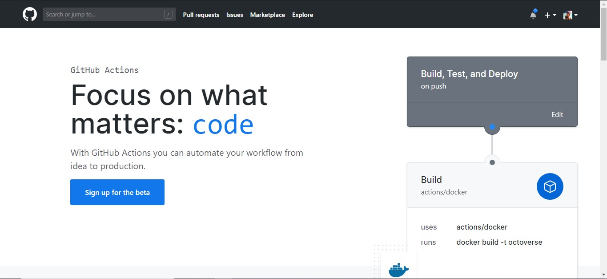
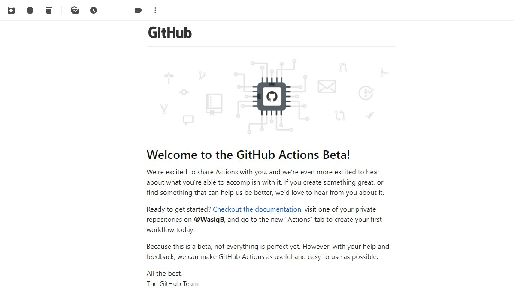
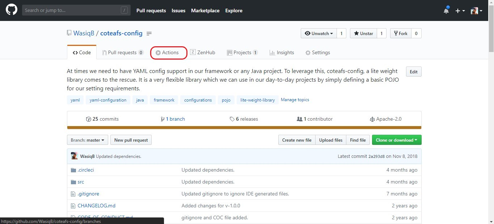
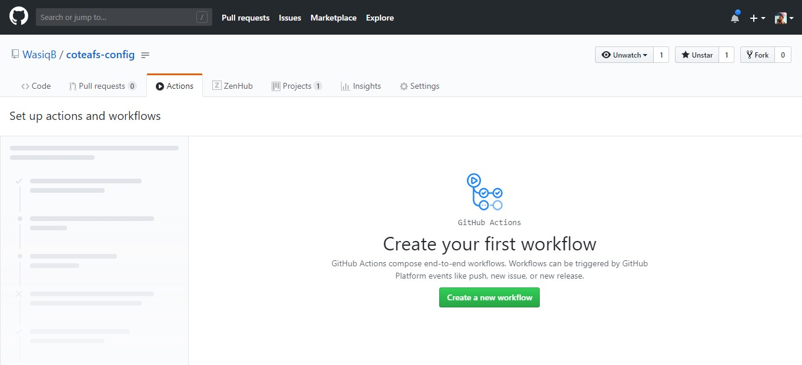
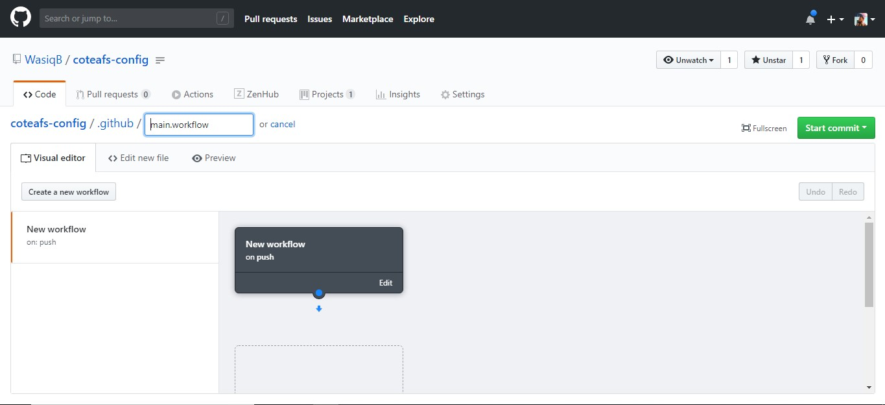
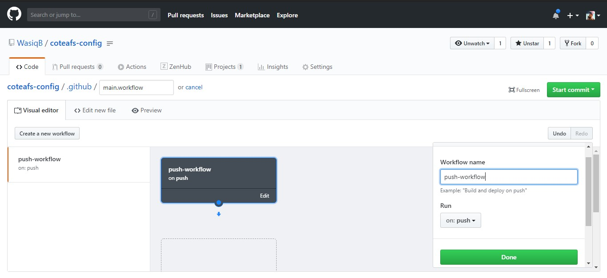
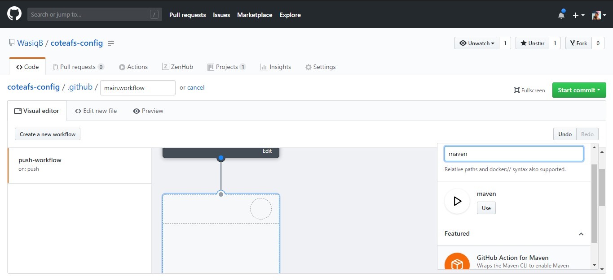
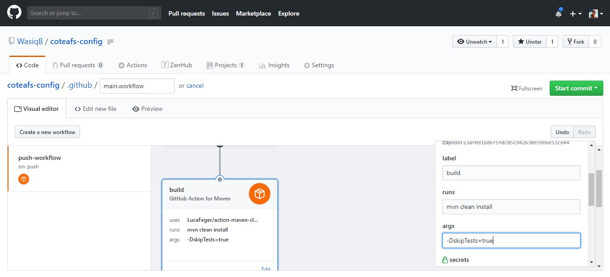
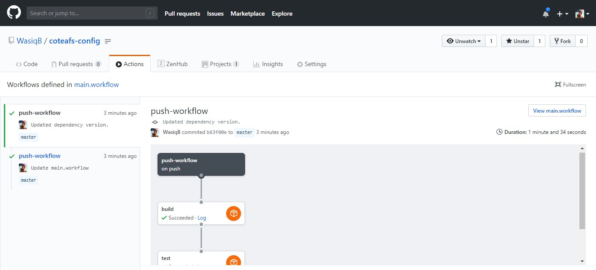

## Introduction

I have been using different Continuous Integration tools over the period of time for my open source projects on GitHub, like, Travis CI, Circle CI, Microsoft Azure pipelines, etc. But recently, when GitHub announced the beta launch of GitHub Actions, I was excited to try my hands on it. With this post I would like to share my experience using GitHub Actions.

<!--truncate-->

## Why to use GitHub Actions?

When I compared what GitHub Actions has to offer as compared to other CI tools, I was even more tempted to try it out. The advantages which I feel makes GitHub Actions stand out is,

| GitHub Actions                                         | Other CI tools                                                                                           |
| ------------------------------------------------------ | -------------------------------------------------------------------------------------------------------- |
| We have more control on the workflow which you create. | We don't have the control when we create the workflow. We are forced to use predefined blocks of config. |
| We can create workflow using a simple designer panel.  | There is no designer panel to create workflow.                                                           |
| The designer generates the workflow config for us.     | We need to manually dig in the docs to find the commands for the workflow we want to create.             |

These points were enough for me to motivate to try GitHub Actions.

## How can you access GitHub Actions?

Anyone who wish to use GitHub Actions need to [sign up for beta][sign-up] access.

You can sign up for early access from this page.

## After sign up, now what?

After signing up, you need to wait for the mail from GitHub Team who will inform you via E-mail when your access is ready. Normally it will take under a week time but it all depends how many requests they have for accessing this feature. In my case it took more then a couple of weeks when I finally received this e-mail.

## You received the access, now where to find GitHub Actions?

After the access is granted to you, you can find a **new Actions** tab in any of your GitHub repositories. Let's see the tab below.

## What's in the Action Tab?

In Actions Tab, you can create your main workflow for your project. This is what you will see in the new tab.

## Let's create your first GitHub Actions workflow.

Now you can start creating your very first workflow from this window by clicking on `Create a new workflow` button. Once you do that you will see this page.

### Step 1. Don't rename the file.

Use the default workflow file name and path. Do not modify the file name. It should be `main.workflow`. This file is used by GitHub to execute all the workflows defined in it.

### Step 2. Edit the workflow name.

In the designer, modify the workflow name which you want and select the event when you want this workflow to get executed. For this posts example, I will name it as `push-workflow` and select **Run on** as `push` as I want this workflow to run on push event.

To edit, click on `Edit` link in the first element in the designer. Same is shown below.

### Step 3. Add first Action in Workflow.

In the designer panel, in the workflow box, there is a blue dot which you can use to drag down to create the first action in the workflow.

When you drag the blue dot down, a new panel box will get created for your action and a small side panel will also open where you can design the action.

In this case, I will find `Maven` action and use it.

### Step 4. Add command for your Maven action.

When you select Maven action, a new panel will open in sidebar. Here you can set the label as `build`, put the maven command `mvn clean install` in `runs` field and put args `-DskipTests=true` in `args` field and click on Done.

Similarly, you can create many synchronous actions in a single workflow as you want.

> I'll create one more action to run the tests after build.

### Step 5. Commit the file after workflow is ready.

Once, your workflow is ready with required actions, you can commit the file using the commit button on the top.

After commit, wait for a minute and check in the action tab, your workflow will get executed for any push you do. Same you can see in our example below,

## Conclusion

As you can see with the example in this post, it is like a cake walk when we created our GitHub Action workflow. The possibilities of using actions is limitless as you can use many other ready-to-use actions as per your requirements. Also you can create your own action which can be used by others as well.

So that was all for Github Actions now, do keep checking this site for more such interesting topics.
If you liked this post then share it in your network using the **SHARE** button below.

[sign-up]: https://github.com/features/actions
